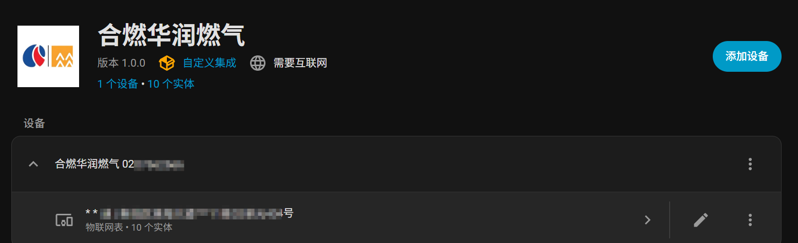
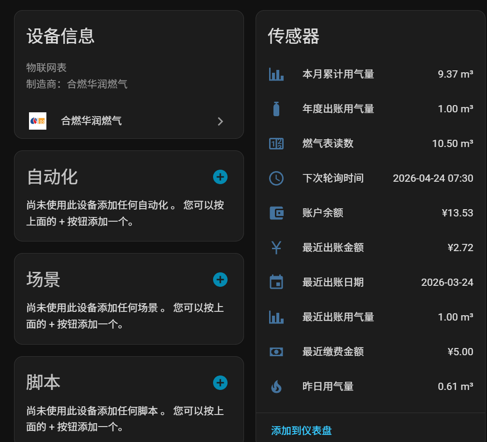

# 合燃华润燃气 Home Assistant 集成

通过合燃华润燃气微信小程序的 API，在 Home Assistant 中获取燃气使用数据。

## 功能

- 昨日用气量
- 本月累计用气量
- 年度出账用气量
- 最近出账用气量
- 最近出账金额
- 最近出账日期
- 燃气表读数
- 账户余额
- 最近缴费金额
- 下次轮询时间
- 每天 07:30 自动轮询数据
- Session 过期自动重新绑定

## 安装

### HACS 安装（推荐）

1. 在 HACS 中添加自定义仓库
2. 搜索并安装 "合燃华润燃气"
3. 重启 Home Assistant

### 手动安装

1. 将 `custom_components/hfcrgas` 文件夹复制到你的 Home Assistant 的 `custom_components` 目录下
2. 重启 Home Assistant

## 配置

1. 进入 **设置** → **设备与服务** → **添加集成**
2. 搜索 **"合燃华润燃气"** 或 **"HFCRGas"**
3. 输入以下信息：
   - **户号**：10位数字的燃气户号（如 0123456789）
   - **户主手机号**：绑定户号时使用的手机号（如 13000000000）
4. 点击提交，系统将自动验证并绑定

## 传感器

配置成功后，将创建以下传感器：

- **集成条目名称**：合燃华润燃气 {户号}
- **设备名称**：{用户名} | {地址}

| 传感器 | 说明 | 单位 |
|--------|------|------|
| 昨日用气量 | 昨日用气量 | m³ |
| 本月累计用气量 | 当月累计用气量 | m³ |
| 年度出账用气量 | 当年出账用气量 | m³ |
| 最近出账用气量 | 最近一期出账用气量 | m³ |
| 最近出账金额 | 最近一期出账金额 | CNY |
| 最近出账日期 | 最近一期出账日期 | - |
| 燃气表读数 | 当前燃气表累计读数 | m³ |
| 账户余额 | 账户剩余余额 | CNY |
| 最近缴费金额 | 最近一次缴费金额 | CNY |
| 下次轮询时间 | 下次数据更新时间 | - |

## 注意事项

- 本集成通过模拟合燃华润燃气微信小程序的 API 获取数据
- 需要确保户号和户主手机号匹配（与微信小程序绑定时一致）
- 数据每天 07:30 更新一次
- 如果 Session 过期，集成会自动重新绑定
- 燃气数据为第二天更新前一天的数据，因此"昨日用气量"实际是最新可获取的数据

## 故障排除

### 绑定失败

- 确认户号为10位数字
- 确认手机号与户主登记的手机号一致
- 检查网络是否能访问 `ehall.hfgas.cn`

### 数据更新失败

- 检查 Home Assistant 日志中的错误信息
- 尝试重新配置集成
